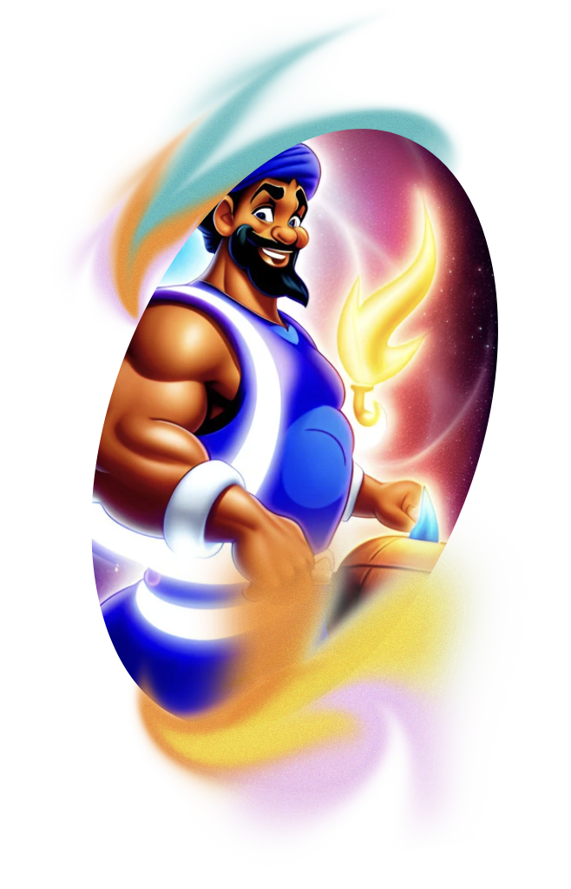

# GymGenie MERN GraphQL WEB APP 
 
 

 

 

## Installation
Please clone repo 
```
https://github.com/pfe-holbies/The_Gym_Genie.git

npm install 
npm start


### Mouna Ben Ali
Mouna has assumed the responsibility of building the primary features and RESTful API on the server side by employing Flask_restful and MongoDB. She also lent her support to Montassar in his work on the client side by acquiring proficiency in React JS. Mouna opted for this role as she desires to improve her skills as a full-stack developer. Furthermore, she aided the team in all feasible ways, starting with the development of suitable documentation and concluding with the cleaning of the repository once the project was completed.

[Click here for Mouna's LinkedIn](https://www.linkedin.com/in/mouna-ben-ali-643bb865/)

[Click here for Mouna's Twitter](https://twitter.com/MunaBenAli)
## Authors (LinkedIn & Github) :black_nib:
Mouna Ben Ali
Saif Elleuch

 
 
 ## Acknowledgments
 * [Holberton School](https://www.holbertonschool.com/) (Staff and Students)
 
 
 
 
 
 
 
 
