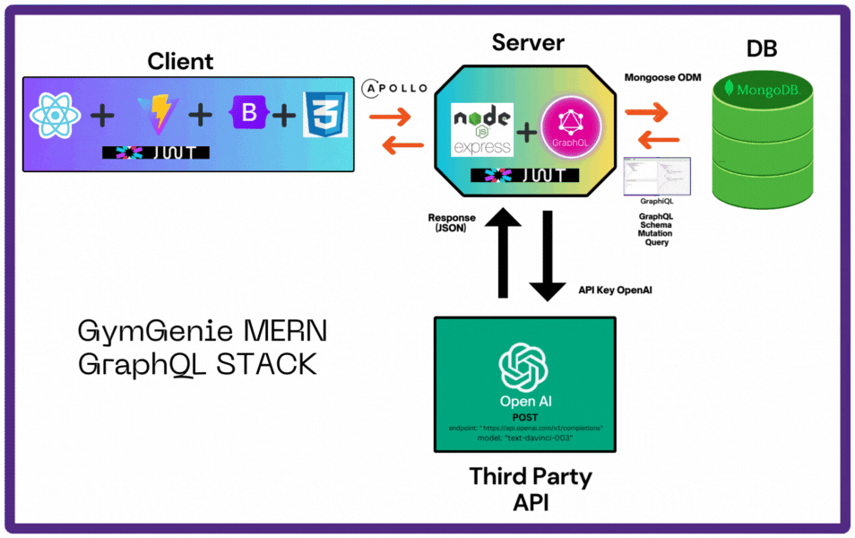
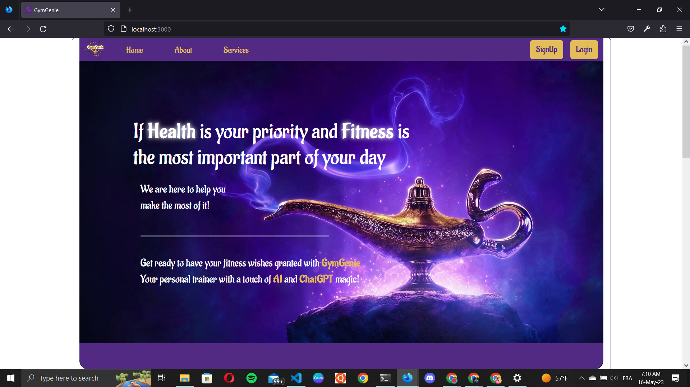
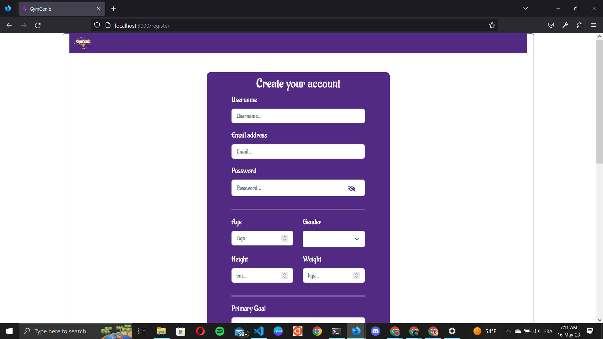
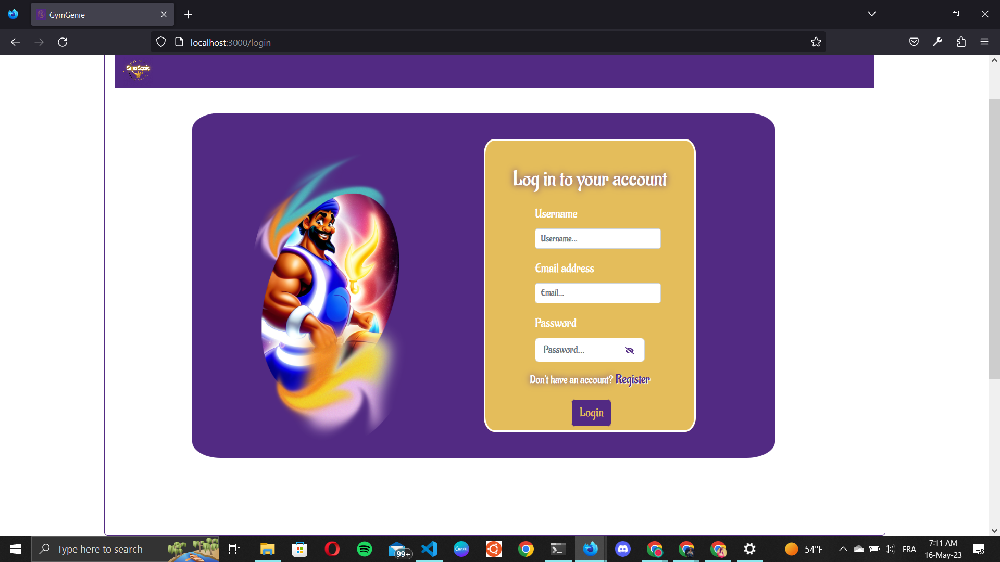
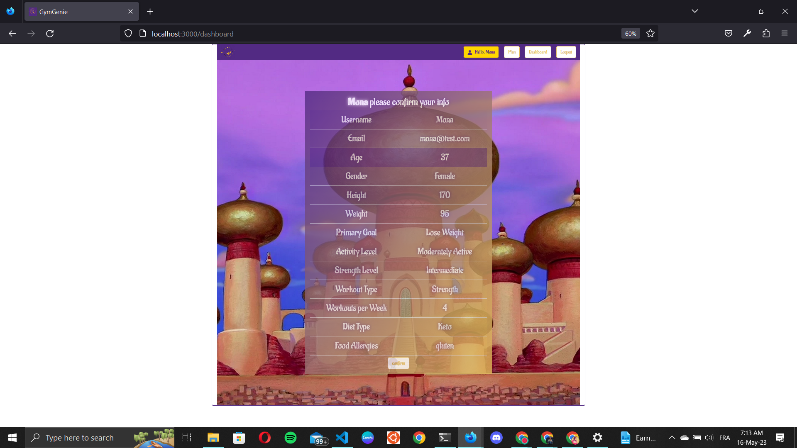
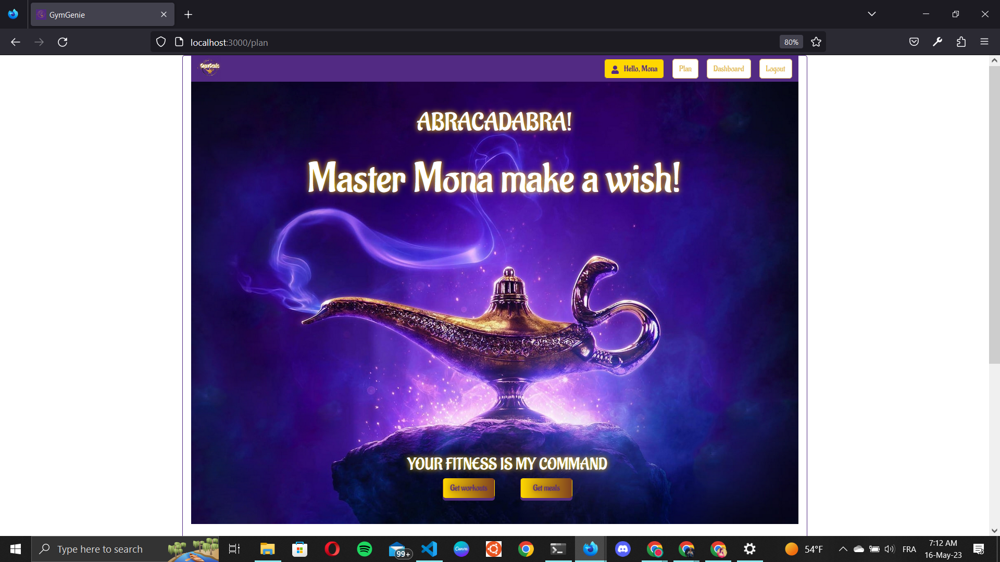
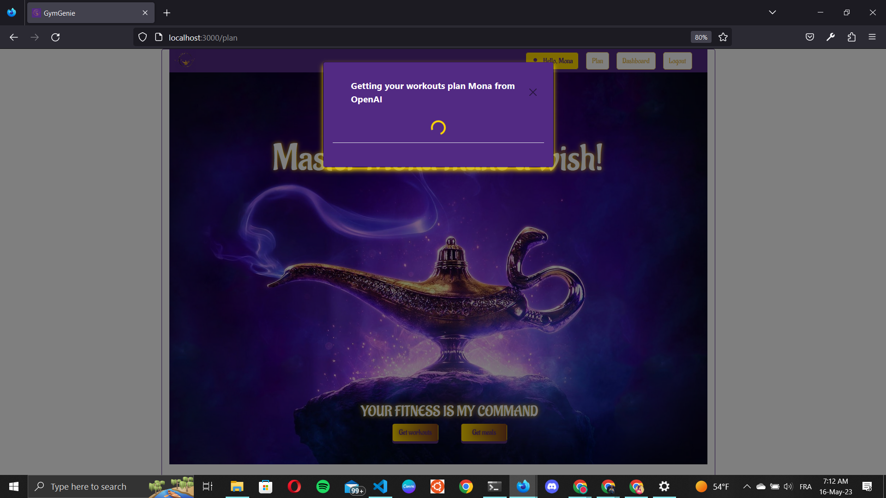
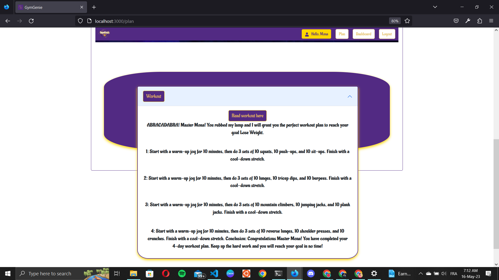

 

# GymGenie MERN GraphQL web App
 
## Intro
This is a a full stack web app build with MERN stack and 
[GraphQL](https://graphql.org/) API in the server side and [Vite](https://vite.dev) Build tool with React on the client side. We are saving our data to mongodb database. 


It includes the following:

- Backend GraphQL API with Express & MongoDB
- JWT authentication middleware
- Protected /graphql endpoint and protected routes on the client
- Custom middleware to connect to OpenAI API and fetch data from model: 'text-davinci-003' endpoint 'https://api.openai.com/v1/completions'
- React client to register, login, logout, confirm user info, fetch workout mutation and fetch meal mutation 
- React Bootstrap UI library and CSS for styling 

## Usage :wrench:

- Create a MongoDB database and obtain your `MongoDB URI` - [MongoDB Atlas](https://www.mongodb.com/cloud/atlas/register)
- Create an OpenAI account and obtain your `API Secret Key` - [ OpenAI platform](https://platform.openai.com/account/api-keys)

### Env Variables

Rename the `.env.example` file to `.env` and add the following

```
NODE_ENV = development
PORT = 5000
MONGO_URI = your mongodb uri
JWT_SECRET = 'abc123'
JWT_EXPIRES_IN = "30 days"
OPENAI_API_KEY
```

### Install Dependencies (client & server)

```
cd server 
npm install
cd client 
npm install
```

### Run

```

# Run client (:3000) & backend (:5000)
npm start (npm-run-all)

# Run backend only
npm run dev
```

## Build

```
# Create frontend prod build
cd client
npm run build
```

## Presentation
[Demo Day Presentation](https://docs.google.com/presentation/d/1JE-LB8VEwsNYHRPgeUXie5NGlfbi8kLjcLJM4HoOXfI/edit?usp=sharing)

##  Architecture
 

##  Userflow
 

## Screenshots :camera:








## Authors :black_nib:
Mouna Ben Ali

Saif Elleuch

 ## Acknowledgments
 * [Holberton School](https://www.holbertonschool.com/) (Staff and Students)